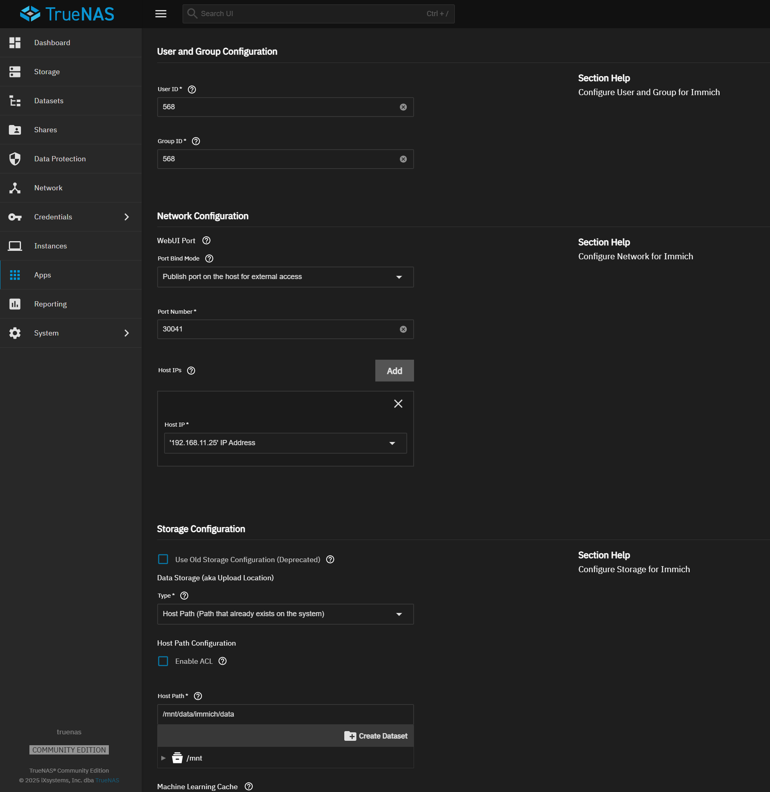

+++
date = '2025-07-26T07:15:57Z'
draft = false
title = 'Immich: moderní galerie fotek na vlastním serveru'
tags = ['Cloudflare', 'Google', 'SSO', 'TrueNAS']
ShowToc = true
TocOpen = true
comments = true
+++

Máte taky tisíce fotek roztroušených po mobilech celé rodiny, na starých discích a v různých cloudových službách? Udržet v tom pořádek a zároveň mít fotky bezpečně zálohované a snadno dostupné je občas úkol pro superhrdinu. Dlouho jsem hledal řešení, které by bylo **jednoduché na používání** pro všechny členy rodiny, **bezpečné**, a hlavně – **pod mojí kontrolou**. A pak jsem narazil na **Immich**. 🚀

Immich je v podstatě váš osobní Google Photos nebo Apple Photos, ale s tím rozdílem, že běží na vašem vlastním hardwaru. Je to open-source projekt, který se vyvíjí neuvěřitelnou rychlostí a nabízí funkce, které byste čekali od placených služeb – automatická záloha z mobilu, rozpoznávání obličejů, vyhledávání podle objektů, sdílená alba a mnoho dalšího.

Ukážeme si, jak zprovoznit Immich v Home Labu. Projdeme si vše od **instalace na TrueNAS**, přes **bezpečné zpřístupnění do internetu** pomocí Cloudflare Tunnels až po **pohodlné přihlašování** přes Google účet.

## Co je Immich a proč ho chtít?

Představte si, že všechny vaše fotky a videa jsou na jednom místě, automaticky se třídí a zálohují, a vy k nim máte přístup z mobilu i z počítače, ať jste kdekoliv. To je Immich. A proč byste ho měli chtít?

- **Plná kontrola nad daty:** Vaše vzpomínky jsou jen vaše. Nejsou na serverech Googlu ani Applu, ale u vás doma.
- **Žádné poplatky za úložiště:** Platíte jen za hardware, který už stejně možná máte. Kapacita je omezena jen velikostí vašich disků.
- **Moderní funkce:** Mobilní aplikace pro Android a iOS, automatický upload, rozpoznávání osob a objektů (díky AI), zobrazení fotek na mapě a skvělé možnosti pro sdílení s rodinou a přáteli.
- **Aktivní vývoj:** Projekt žije a nové funkce přibývají jako houby po dešti.

## Potřebné vybavení a předpoklady

Než se pustíme do instalace, ujistíme se, že máme vše po ruce.

- **Server s TrueNAS:** Já používám **TrueNAS SCALE**, který skvěle podporuje aplikace v kontejnerech (Docker). Budete potřebovat dostatek místa na disku pro vaši sbírku fotek.
- **Doména:** Budete potřebovat vlastní doménu (např. `mojedomena.cz`). Použijeme ji pro snadný a bezpečný přístup k Immich.
- **Cloudflare účet:** Pro bezpečné zpřístupnění aplikace do internetu využijeme službu **Cloudflare Tunnels**. Je zdarma a jednoduchá.
- **Google účet (volitelně):** Pro nastavení pohodlného přihlašování pomocí **SSO (Single Sign-On)**. Ideální, pokud používáte Google Workspace pro rodinné účty.

## Instalace na TrueNAS: Kde budou fotky bydlet

Můj Immich běží na serveru s **TrueNAS SCALE 25.04.1**, kde mám dostatek úložného prostoru. Instalace přes komunitní katalog aplikací je hračka.

### 1. Příprava úložiště (Datasets)

Nejdříve si připravíme místo pro data aplikace a databázi. Vytvoření samostatných datasetů nám usnadní budoucí správu a zálohování.

1. V TrueNAS přejděte do sekce `Datasets`.
2. Vytvořte hlavní dataset pro aplikaci:
    - Klikněte na `Add Dataset`.
    - **Name:** `immich`
    - **Dataset Preset:** `Apps`
3. Nyní vytvoříme vnořené datasety pro data a databázi. Klikněte na nově vytvořený dataset `immich` a postup opakujte:
    - Vytvořte dataset s názvem `data`.
    - Vytvořte dataset s názvem `postgres`.
4. U obou nových datasetů (`data` i `postgres`) je potřeba nastavit správná oprávnění. Klikněte na dataset, zvolte `Edit` v sekci `Permissions` a nastavte vlastníka na `apps` a skupinu také na `apps` (`Owner: apps`, `Owner Group: apps`).

### 2. Instalace aplikace Immich

Teď už můžeme nainstalovat samotnou aplikaci.

1. Přejděte do `Apps` -> `Discover Apps`.
2. Vyhledejte `Immich` a klikněte na `Install`.
3. V konfiguračním průvodci vyplňte potřebné údaje. Nejdůležitější je správně namapovat úložiště, které jsme si připravili v předchozím kroku.
4. Dokončete instalaci.

**⭐ Tip z praxe:** Po prvním spuštění a otestování jsem aplikaci přidal více systémových prostředků. Zvláště při prvotním importu a analýze tisíců fotek (generování náhledů) se každý kousek výkonu navíc počítá. Nastavil jsem **4 vCPU a 6 GB RAM**, což výrazně zrychlilo zpracování fronty úloh.

## Vzdálený přístup: Bezpečně do světa s Cloudflare Tunnels

Dostat se k fotkám z dovolené nebo z rodinné oslavy, když nejste doma, je klíčové. Ale vystavit aplikaci jen tak do internetu je obrovské bezpečnostní riziko.

> Nikdy, ale opravdu nikdy, nepřesměrovávejte port aplikace (v případě Immich na TrueNASu 30041) přímo na vaši veřejnou IP adresu! Vystavili byste webové rozhraní přes nezabezpečené HTTP, což je otevřená pozvánka pro útoky typu Man-in-the-middle.

My na to půjdeme chytře. Pro přístup z vnitřní sítě používám **Nginx Proxy Manager**, ale pro přístup z internetu nasadíme **Cloudflare Tunnel**.

### Proč zrovna Cloudflare Tunnel?

Je to elegantní a bezpečné řešení. Na vašem serveru běží malá aplikace (konektor), která naváže **šifrované spojení směrem ven** k serverům Cloudflare. Váš server tak nemusí mít žádný otevřený port do internetu a vaše veřejná IP adresa zůstane skrytá. Útočníci tak nemohou skenovat vaše porty a hledat zranitelnosti. Geniální, že?

### Jak na to?

1. Přihlaste se do svého Cloudflare účtu a přejděte do sekce `Zero Trust`.
2. V menu vlevo vyberte `Networks` -> `Tunnels` a klikněte na `Create a tunnel`.
3. Zvolte typ konektoru **Cloudflared** a pojmenujte si tunel (např. `homelab-truenas`).
4. Cloudflare vám vygeneruje příkaz pro spuštění konektoru. Jelikož máme TrueNAS, zvolíme možnost **Docker**. Zobrazí se vám příkaz `docker run ...`, který obsahuje unikátní token pro váš tunel.
5. Já pro správu Dockeru používám **Portainer**, kde je nasazení nového kontejneru otázkou chvilky. Důležité je použít ten vygenerovaný příkaz s tokenem.
6. Jakmile kontejner běží, v Cloudflare uvidíte, že je váš tunel aktivní. Paráda!

Teď už jen řekneme tunelu, kam má posílat provoz.

1. Vraťte se do nastavení tunelu v Cloudflare (`Networks -> Tunnels`), klikněte na váš nově vytvořený tunel a zvolte záložku `Public Hostname`.
2. Klikněte na `Add a public hostname`.
3. **Subdomain:** Zadejte subdoménu, na které Immich poběží (např. `photos`).
4. **Domain:** Vyberte vaši doménu. Výsledná adresa bude `photos.mojedomena.cz`.
5. **Service Type:** Zvolte `HTTP`.
6. **URL:** Zadejte **lokální IP adresu a port** vaší Immich instance (např. `192.168.100.2:30041`).
7. Uložte.

Cloudflare automaticky vytvoří potřebný DNS záznam a během chvilky by měl být váš Immich dostupný na zadané adrese přes zabezpečené HTTPS spojení.

### Důležitý krok v Immich

Aby Immich věděl, na jaké adrese je dostupný zvenku (a mohl tak správně generovat například odkazy pro sdílení), musíme mu tuto adresu sdělit.

Jděte do `Immich -> Administration -> Settings -> Server` a do pole **External URL** zadejte vaši novou veřejnou adresu (např. `https://photos.mojedomena.cz`).

## Přihlášení pro profíky (a rodinu): SSO s Googlem

Výchozí přihlašování jménem a heslem je fajn, ale my chceme něco pohodlnějšího a bezpečnějšího. Immich podporuje **OAuth**, což nám umožní přihlašovat se pomocí existujících účtů, například od Googlu. Pro mě ideální, protože pro rodinu používám e-maily na vlastní doméně přes Google Workspace.

Dokumentace Immich je v tomto skvělá a podrobná, takže doporučuji nahlédnout: [OAuth Authentication | Immich](https://immich.app/docs/administration/oauth/).

Zde je zkrácený postup:

1. Přihlaste se do **Google Cloud Console** a jděte do `APIs & Services -> Credentials`.
2. Klikněte na `CREATE CREDENTIALS` -> `OAuth client ID`.
3. **Application type:** `Web application`.
4. **Name:** Pojmenujte si aplikaci, např. `Immich Photos`.
5. **Authorized redirect URIs:** Toto je klíčový krok. Přidejte sem URL adresy podle dokumentace Immich. Obvykle to bude něco jako `https://photos.mojedomena.cz/auth/login` a `https://photos.mojedomena.cz/api/oauth/callback`.
6. Uložte. Zobrazí se vám **Client ID** a **Client Secret**. Tyto údaje si bezpečně uložte.

Nyní v administraci Immich (`Administration -> Settings -> OAuth`):

1. Zapněte `Enable OAuth`.
2. Zvolte `Google` jako poskytovatele.
3. Vložte **Client ID** a **Client Secret**, které jste získali z Google Cloud Console.
4. Vyplňte **Issuer URL**: `https://accounts.google.com`.
5. Uložte nastavení.

Po uložení by se na přihlašovací stránce mělo objevit tlačítko "Login with Google". Jakmile jsem si ověřil, že vše funguje, vrátil jsem se do administrace a **vypnul přihlašování heslem** (`Password Login: Disabled`). Teď je jediná cesta dovnitř přes bezpečné přihlášení Googlem.

Ještě jsem si pohrál s tímto nastavením OAuth:

- **Auto Register (vypnuto):** Nechci, aby se kdokoliv s Google účtem mohl automaticky zaregistrovat. Nové uživatele přidávám ručně.
- **Auto Launch (zapnuto):** Po odladění jsem tuto volbu zapnul. Jakmile přijdete na přihlašovací stránku, rovnou vás to přesměruje na Google přihlášení, což je super plynulé.
- **Mobile Redirect Override (zapnuto):** Důležité pro správnou funkci přihlášení v mobilní aplikaci.

## Závěr

A je to! Máme plně funkční, rychlou a bezpečnou platformu pro správu fotek pro celou rodinu. Běží na našem vlastním hardwaru, je přístupná odkudkoliv a nabízí moderní funkce, na které jsme zvyklí. Investovaný čas se vrátí v podobě klidu, že mé digitální vzpomínky jsou v bezpečí a pod mou kontrolou. Už žádné hledání fotek na různých místech.

Co vy a vaše fotky? Používáte nějaké podobné řešení, nebo se teprve odhodláváte? **Podělte se o své zkušenosti a plány v komentářích!**
