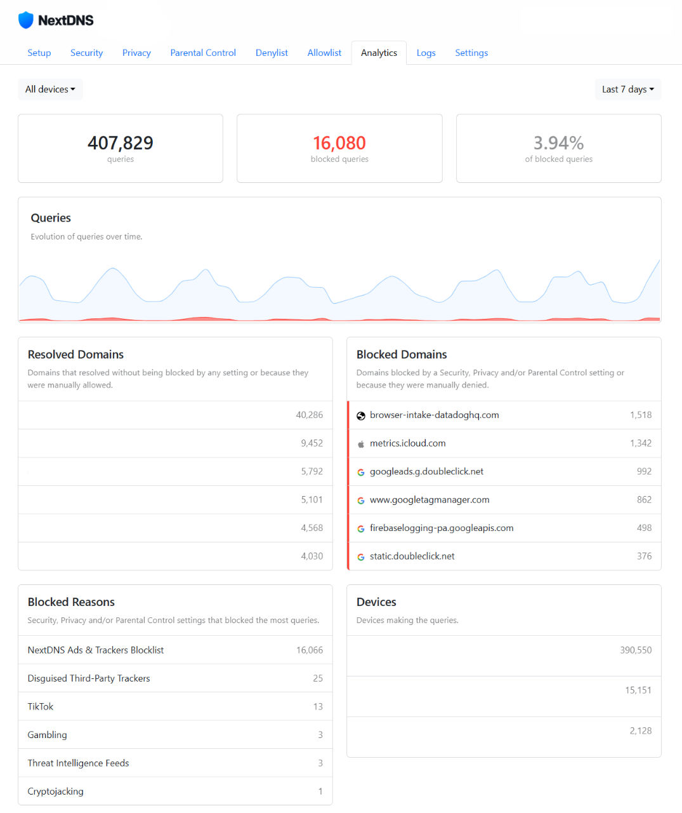
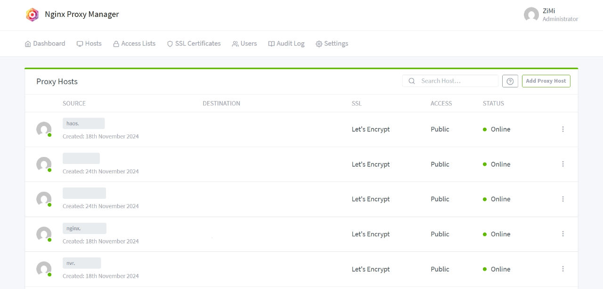

+++
date = '2025-04-12T11:15:57Z'
draft = false
title = 'NextDNS na Mikrotiku a HTTPS pro služby v Home Lab'
tags = ['Mikrotik', 'DNS', 'HTTPS', 'DoH']
ShowToc = true
TocOpen = true
comments = true
+++

## Zabezpečte svou síť na maximum

Provozujete domácí laboratoř (Home Lab) nebo jen chcete mít lepší kontrolu a bezpečí ve vaší síti? Pak jsou pro vás klíčové dva aspekty: bezpečné řešení DNS dotazů a šifrovaná komunikace i pro služby běžící uvnitř vaší sítě. V tomto článku si ukážeme, jak jsem si nastavil službu NextDNS na routeru Mikrotik pomocí šifrovaného protokolu DNS-over-HTTPS (DoH) a jak zajistil důvěryhodné HTTPS certifikáty pro interní aplikace pomocí Let's Encrypt a Nginx Proxy Manageru.

Router nemusí být jen bránou do internetu. Může fungovat jako výkonný DNS resolver a cache pro všechna zařízení v lokální síti. Zařízení se pak neptají přímo externích serverů, ale vašeho routeru nebo DNS serveru, který dotazy buď zodpoví z vlastní rychlé paměti (cache), nebo je bezpečně přepošle dál.

### Proč řešit bezpečné DNS?

Standardní DNS dotazy jsou v internety přenášeny nešifrovaně, což znamená, že váš poskytovatel internetu (a kdokoliv jiný "po cestě") může vidět, jaké weby navštěvujete. Filtrování a šifrování DNS je proto zásadní pro:

1. **Soukromí:** Zabraňuje odposlechu vaší online aktivity.
2. **Bezpečnost:** Umožňuje blokovat škodlivé weby (malware, phishing), reklamy a sledovací nástroje.
3. **Rodičovskou kontrolu:** Filtrování nevhodného obsahu.

Můžete využít různé služby. Cloudové jako **NextDNS** (moje volba), Cloudflare (1.1.1.1), Control D nebo Quad9 (9.9.9.9) nabízejí snadné nastavení a pokročilé funkce. Alternativou je lokální řešení jako Pi-hole, které si musíte spravovat sami.



### Nastavení NextDNS přes DNS-over-HTTPS (DoH) na Mikrotiku (RouterOS v7+)

DNS-over-HTTPS (DoH) zapouzdřuje DNS dotazy do šifrovaného HTTPS spojení, čímž výrazně zvyšuje soukromí a bezpečnost. RouterOS verze 7 a novější toto podporuje nativně.

### 1. Import kořenových certifikátů

Aby Mikrotik mohl ověřit certifikát DoH serveru (v našem případě NextDNS), potřebuje znát důvěryhodné kořenové certifikační autority. Nejjednodušší je stáhnout a importovat balík `cacert.pem` z `curl.se`, který obsahuje většinu běžně používaných certifikátů.

```
/tool fetch url=https://curl.se/ca/cacert.pem
/certificate import file-name=cacert.pem passphrase=""
```

_(Poznámka: Při importu můžete být vyzváni k zadání hesla – pokud balík heslo nemá, nechte `passphrase` prázdné.)_

### 2. Nastavení statických DNS záznamů pro NextDNS

Aby Mikrotik věděl, na jaké IP adresy se má připojit pro DoH ještě předtím, než samotné DNS funguje, nastavíme statické záznamy pro `dns.nextdns.io`.

```
/ip dns static
add name=dns.nextdns.io address=45.90.28.0 type=A
add name=dns.nextdns.io address=45.90.30.0 type=A
add name=dns.nextdns.io address=2a07:a8c0:: type=AAAA
add name=dns.nextdns.io address=2a07:a8c1:: type=AAAA
```

### 3. Konfigurace DNS serveru a DoH

Nyní nakonfigurujeme samotný DNS resolver na Mikrotiku. Vymažeme případné staré servery, povolíme dotazy z lokální sítě, nastavíme velikost cache a hlavně zapneme DoH s unikátní NextDNS adresou.

- Nejprve si zjistěte svůj **NextDNS profil ID** v nastavení vašeho účtu na `nextdns.io`. Bude to unikátní řetězec znaků.
- Pak spusťte následující příkazy (nahraďte `YOUR_PROFILE_ID` vaším skutečným ID):

```
/ip dns set servers=""
/ip dns set allow-remote-requests=yes cache-size=20480KiB use-doh-server="https://dns.nextdns.io/YOUR_PROFILE_ID" verify-doh-cert=yes
```

- `allow-remote-requests=yes`: Povolí Mikrotiku přijímat DNS dotazy od klientů v LAN.
- `cache-size=20480KiB`: Nastaví velikost DNS cache (upravte podle potřeby, 20MB je rozumný začátek).
- `use-doh-server`: Zde zadáte vaši NextDNS DoH adresu.
- `verify-doh-cert=yes`: Zajistí ověření certifikátu DoH serveru pomocí dříve importovaných kořenových certifikátů.

### 4. Zabezpečení DNS serveru (Firewall)

Je **naprosto klíčové**, aby váš Mikrotik DNS server nepřijímal dotazy z internetu (WAN), ale pouze z vaší lokální sítě (LAN).

- Nejprve se ujistěte, že máte vytvořený `interface list` pro vaši LAN (např. s názvem `LAN`). Pokud ne, vytvořte jej a přidejte do něj relevantní bridge nebo ethernet porty.
- Přidejte následující pravidla do firewallu (`/ip firewall filter`):

```
/ip firewall filter
# Povolit DNS dotazy z LAN na Mikrotik
add action=accept chain=input comment="Allow DNS from LAN (TCP)" dst-port=53 in-interface-list=LAN protocol=tcp
add action=accept chain=input comment="Allow DNS from LAN (UDP)" dst-port=53 in-interface-list=LAN protocol=udp

# Zahodit DNS dotazy z WAN (Internetu)
# Nahraďte ether1-WAN vaším skutečným WAN rozhraním nebo WAN interface listem
add action=drop chain=input comment="Drop DNS from WAN (TCP)" dst-port=53 in-interface=ether1-WAN log=yes log-prefix="DNS_DROP_WAN" protocol=tcp
add action=drop chain=input comment="Drop DNS from WAN (UDP)" dst-port=53 in-interface=ether1-WAN log=yes log-prefix="DNS_DROP_WAN" protocol=udp
```

_(Poznámka: Logování `log=yes` je užitečné pro ověření, že pravidla fungují, ale pro produkční nasazení jej můžete vypnout, aby se zbytečně neplnil log.)_

### 5. Vynucení používání Mikrotik DNS (NAT)

Některá zařízení (chytré televize, IoT zařízení, mobily) mohou mít DNS servery nastavené "natvrdo" (např. Google DNS 8.8.8.8) a ignorovaly by tak nastavení z DHCP. Aby **všechna** zařízení ve vaší síti musela používat váš zabezpečený DNS (a tím pádem NextDNS filtraci), vytvoříme pravidla v NAT, která veškerý odchozí provoz na portu 53 (DNS) přesměrují zpět na samotný Mikrotik.

```
/ip firewall nat
# Přesměrovat veškerý TCP DNS provoz z LAN (kromě provozu z WAN) na Mikrotik
add action=redirect chain=dstnat comment="Force Internal DNS (TCP)" dst-port=53 in-interface-list=!WAN log=yes log-prefix="DNS_REDIRECT" protocol=tcp to-ports=53
# Přesměrovat veškerý UDP DNS provoz z LAN (kromě provozu z WAN) na Mikrotik
add action=redirect chain=dstnat comment="Force Internal DNS (UDP)" dst-port=53 in-interface-list=!WAN log=yes log-prefix="DNS_REDIRECT" protocol=udp to-ports=53
```

_(Poznámka: Používáme `in-interface-list=!WAN`, což znamená "provoz přicházející z jakéhokoliv rozhraní, které není v seznamu WAN". Ujistěte se, že máte `interface list` s názvem `WAN`, který obsahuje vaše internetové připojení.)_

Tímto máme zajištěno, že veškerý DNS provoz z vaší sítě prochází přes Mikrotik a je filtrován a šifrován pomocí NextDNS.

## HTTPS pro všechny interní služby: Proč a jak?

Proč používat HTTPS (SSL/TLS certifikáty) i pro služby, které běží jen ve vaší domácí síti (např. webové rozhraní NASu, Home Assistant, různé Docker kontejnery)?

- **Důvěryhodnost:** Prohlížeče nebudou zobrazovat ošklivá varování o nedůvěryhodném připojení.
- **Šifrování:** I když je to "jen" lokální síť, šifrování chrání přihlašovací údaje a citlivá data před případným odposlechem uvnitř sítě.
- **Moderní standard:** Mnoho aplikací a technologií dnes HTTPS vyžaduje nebo preferuje.

Nejlepší způsob, jak toho dosáhnout, je použít certifikáty od **Let's Encrypt**, což je bezplatná a automatizovaná certifikační autorita. Pro získání certifikátu pro interní doménu (která není veřejně dostupná z internetu) je ideální metoda **ACME DNS-01 challenge**.

### Jak funguje DNS-01 challenge?

Při této metodě nemusíte vystavovat vaši službu do internetu. Stačí, když prokážete kontrolu nad DNS záznamy pro vaši doménu. ACME klient (nástroj pro komunikaci s Let's Encrypt) automaticky vytvoří speciální TXT záznam ve vaší DNS zóně. Let's Encrypt si tento záznam ověří a pokud sedí, vydá vám certifikát.

**Nástroje a postup:**

1. **Veřejná doména:** Potřebujete vlastnit veřejnou doménu (např. `mojedomena.cz`). Nemusíte na ní nic hostovat, jde jen o možnost spravovat její DNS záznamy.
2. **DNS Provider s API:** Váš poskytovatel DNS hostingu musí podporovat automatizovanou správu záznamů přes API (Application Programming Interface). Mnoho registrátorů a specializovaných DNS služeb (já používám Cloudflare) to umožňuje.
3. **ACME klient:** Nástroj, který se postará o komunikaci s Let's Encrypt a vaším DNS providerem. Skvělou volbou pro správu interních služeb je **Nginx Proxy Manager (NPM)**.
    - **Nginx Proxy Manager:** Je to snadno použitelný reverzní proxy server (často běžící v Dockeru), který umí:
        - Směrovat provoz na vaše interní služby (NAS, Home Assistant, web servery...).
        - Automaticky získávat a obnovovat Let's Encrypt certifikáty (včetně metody DNS-01).
        - Centrálně spravovat HTTPS pro všechny vaše aplikace.
    - Alternativně DNS-01 challenge podporují i jiné nástroje jako **TrueNAS Scale**, **Proxmox VE** nebo nástroje jako `acme.sh`.



**Příklad konfigurace:**

- Nainstalujete si Nginx Proxy Manager (např. jako Docker kontejner).
- V NPM přidáte údaje pro přístup k API vašeho DNS providera.
- Vytvoříte "Proxy Host" pro vaši interní službu (např. `nas.mojedomena.cz` směřující na lokální IP adresu vašeho NASu `192.168.1.10`).
- V nastavení tohoto hosta na záložce "SSL" zvolíte vygenerování nového Let's Encrypt certifikátu a vyberete metodu DNS-01 challenge s vaším nakonfigurovaným DNS providerem.
- NPM se postará o zbytek – získá certifikát a bude ho automaticky obnovovat.

**Lokální DNS záznamy na Mikrotiku:**

Aby vaše zařízení v lokální síti věděla, že `nas.mojedomena.cz` (samozřejmě použijte vaši skutečnou doménu místo `mojedomena.cz`) má směřovat na lokální IP adresu vašeho Nginx Proxy Manageru (který pak provoz přesměruje na skutečný NAS), přidáte statické DNS záznamy na Mikrotiku:

```
/ip dns static
# Předpokládáme, že Nginx Proxy Manager běží na 192.168.130.2
# Všechny vaše interní subdomény budou směřovat na NPM
add address=192.168.130.2 name=nginx.mojedomena.cz type=A comment="Nginx Proxy Manager IP"
add cname=nginx.mojedomena.cz name=haos.mojedomena.cz type=CNAME comment="Home Assistant přes NPM"
add cname=nginx.mojedomena.cz name=nas.mojedomena.cz type=CNAME comment="NAS přes NPM"
```

_(Poznámka: Použití CNAME záznamů usnadňuje správu – pokud změníte IP adresu NPM, stačí upravit jediný A záznam.)_

Výhodou je, že jakmile toto jednou nastavíte, vše funguje automaticky. Certifikáty jsou důvěryhodné pro všechna vaše zařízení a komunikace je šifrovaná.

## Závěr

Zabezpečení domácí sítě a Home Labu nemusí být složité. Kombinací Mikrotik routeru, služby jako NextDNS pro filtrované a šifrované DNS (přes DoH) a Nginx Proxy Manageru pro snadnou správu důvěryhodných HTTPS certifikátů pro interní služby získáte robustní a bezpečné prostředí. Nejdůležitější je začít a projít si počáteční konfigurací – odměnou vám bude automatizovaný a bezpečný provoz vaší sítě.
