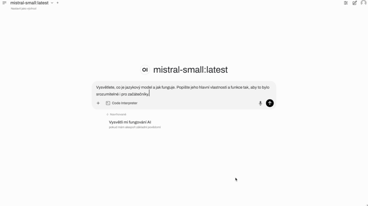

+++
date = '2025-03-25T09:59:04Z'
draft = false
title = 'Jak spustit vlastní jazykový model lokálně: Kompletní návod'
kategorie = ['Návod']
tags = ['LLM', 'Ollama', 'Docker', 'OpenWebUI', 'AI']
ShowToc = true
TocOpen = true

+++

## Proč provozovat jazykový model lokálně?

Lokální AI vám dává kontrolu nad daty, pracuje offline, umožňuje hlubší integrace do vlastních aplikací a dlouhodobě šetří náklady.

> 📦 **Open-source projekt:** Tento návod vychází z open-source stacku dostupného na GitHubu: [ZiMi-lab/local-llm-stack](https://github.com/ZiMi-lab/local-llm-stack), kde najdete veškeré konfigurační soubory, šablony a další nástroje potřebné k nasazení lokálního jazykového modelu.



---

## Požadavky na instalaci

**Hardwarové požadavky:**
- NVIDIA GPU s podporou CUDA
- Min. 16 GB RAM (doporučeno více pro větší modely)
- SSD disk

**Software:**
- Linux nebo WSL2/macOS (s omezením GPU podpory)
- [Docker + Docker Compose](https://docs.docker.com/engine/install/)
- [NVIDIA Container Toolkit](https://docs.nvidia.com/datacenter/cloud-native/container-toolkit/install-guide.html)
- [Ollama (mimo Docker)](https://github.com/ollama/ollama/blob/main/docs/linux.md)

---

## Instalace krok za krokem

### 1. Instalace Dockeru a NVIDIA nástrojů

```bash
apt-get update
apt-get install ca-certificates curl
install -m 0755 -d /etc/apt/keyrings
curl -fsSL https://download.docker.com/linux/ubuntu/gpg | sudo tee /etc/apt/keyrings/docker.asc > /dev/null
chmod a+r /etc/apt/keyrings/docker.asc
echo \  
  "deb [arch=$(dpkg --print-architecture) signed-by=/etc/apt/keyrings/docker.asc] https://download.docker.com/linux/ubuntu \  
  $(. /etc/os-release && echo "$VERSION_CODENAME") stable" | \  
  tee /etc/apt/sources.list.d/docker.list > /dev/null
apt-get update
apt-get install docker-ce docker-ce-cli containerd.io docker-compose-plugin
```

### 2. Instalace Ollamy

```bash
curl -fsSL https://ollama.com/install.sh | sh
ollama help  # ověření funkčnosti
```

Volitelně nastavte prostředí v systemd (v případě, kdy chcete povolit přístup k Ollama a jazykovému modelu i z jiných zařízení):
```bash
systemctl edit ollama.service
# přidejte:
[Service]
Environment="OLLAMA_HOST=0.0.0.0"

systemctl daemon-reload
systemctl restart ollama
```

---

### 3. Klonování projektu a nastavení prostředí

```bash
git clone https://github.com/ZiMi-lab/local-llm-stack.git
cd local-llm-stack
cp .env.example .env
nano .env  # upravte např. WEBUI_URL, OLLAMA_BASE_URL
```

> 🛡️ **Bezpečnostní poznámka:** Soubor `.env` obsahuje citlivé údaje jako URL, API klíče či konfigurační volby. Tento soubor by měl být vždy uveden v `.gitignore` a **nikdy necommitován do veřejného repozitáře**. Pokud provozujete systém ve veřejné síti, ujistěte se, že soubor je chráněn správnými přístupovými právy (`chmod 600 .env`).

Zkopírujte Nginx šablonu:
```bash
cp nginx/templates/default.conf.template.example nginx/templates/default.conf.template
```

---

### 4. Nastavení SSL certifikátů

Do složky `nginx/ssl` vložte:
- `cert.crt` – certifikát
- `privkey.key` – privátní klíč

Pro testování lze vygenerovat self-signed certifikát:
```bash
openssl req -x509 -nodes -days 365 -newkey rsa:2048 \
-keyout nginx/ssl/privkey.key \
-out nginx/ssl/cert.crt
```

---

### 5. Spuštění služeb

```bash
docker compose up -d
```

Ověření běhu:
```bash
docker ps
```

Webové rozhraní by mělo být dostupné na:
- http://localhost:3000 (nebo přes reverzní proxy na vlastní doméně)

---

## Popis služeb

Docker Compose nasazuje:
- **openwebui** – webové rozhraní pro LLM (Open WebUI)
- **nginx** – reverzní proxy (možnost SSL)
- **watchtower** – automatická aktualizace kontejnerů
- **tika** – extrakce textu z dokumentů (PDF, DOC)
- **backend** – API a zpracování souborů

> ℹ️ **Poznámka k aktualizacím:** Automatické aktualizace pomocí služby `watchtower` usnadňují údržbu, ale **v produkčním prostředí se doporučuje ruční kontrola a testování aktualizací**, aby nedošlo k nečekanému výpadku služeb.

---
## Nahrávání dokumentů přes API

FastAPI backend nabízí endpoint `/upload`:

**Příklad cURL (Linux):**
```bash
curl -X POST https://vášserver.cz/upload \
-F "token=secret123" \
-F "target_dir=docs" \
-F "files=@file.pdf"
```

---

## Aktualizace a údržba

Pro aktualizaci stačí:
```bash
cd /opt/webui
docker compose pull
docker compose up --force-recreate --build -d
docker image prune -f
```

---

## Shrnutí

S využitím nástrojů jako Docker, Ollama a Open WebUI lze spustit jazykový model lokálně, včetně webového rozhraní, zpracování dokumentů a možnosti RAG databáze. Tento přístup přináší kontrolu nad daty, offline dostupnost a flexibilitu pro pokročilé integrace.